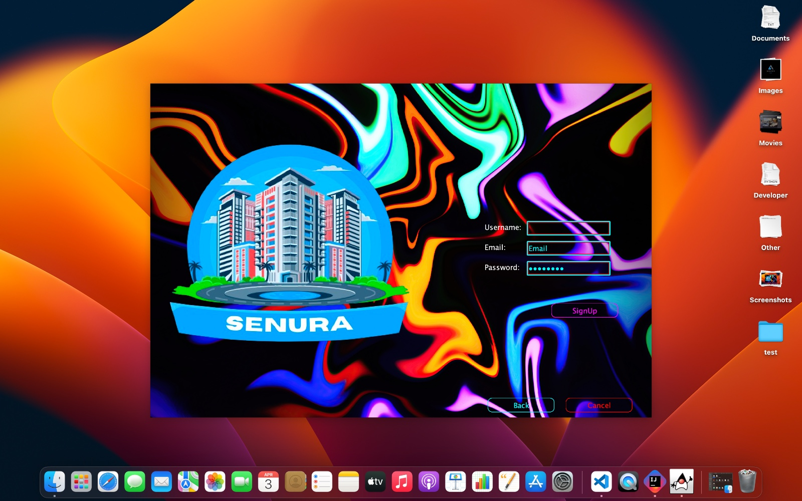
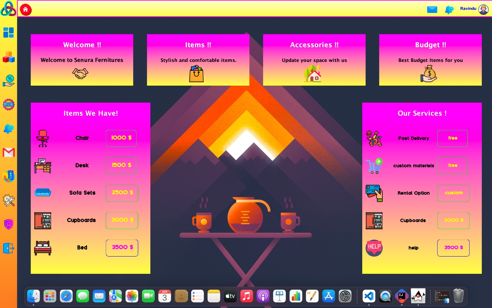
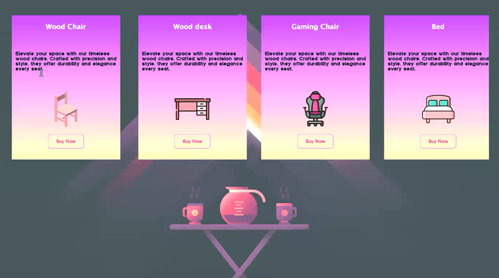
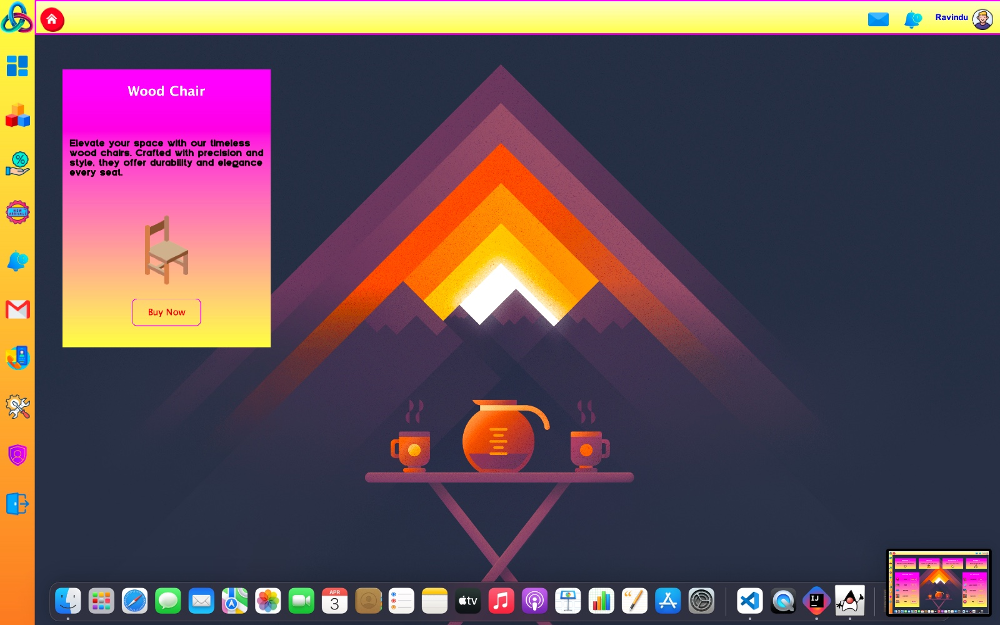
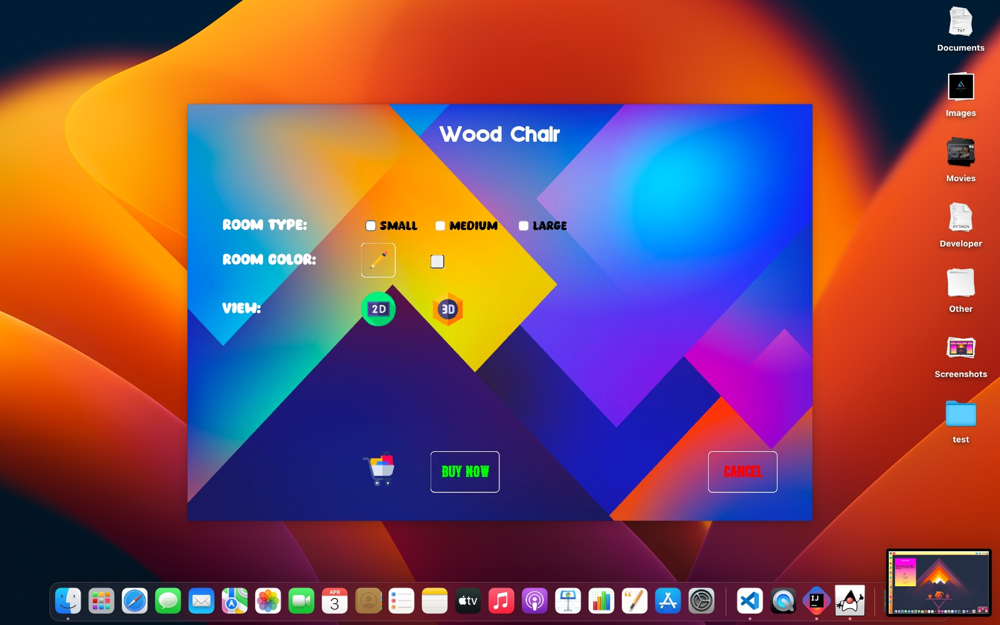
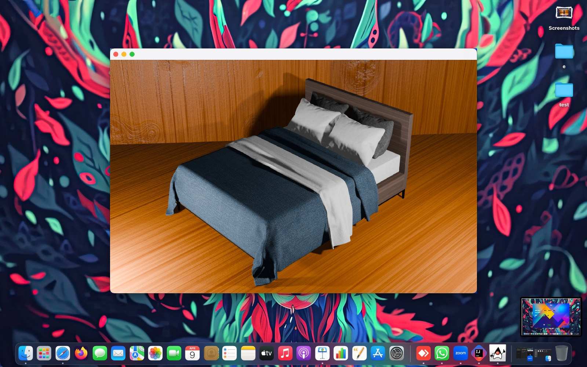
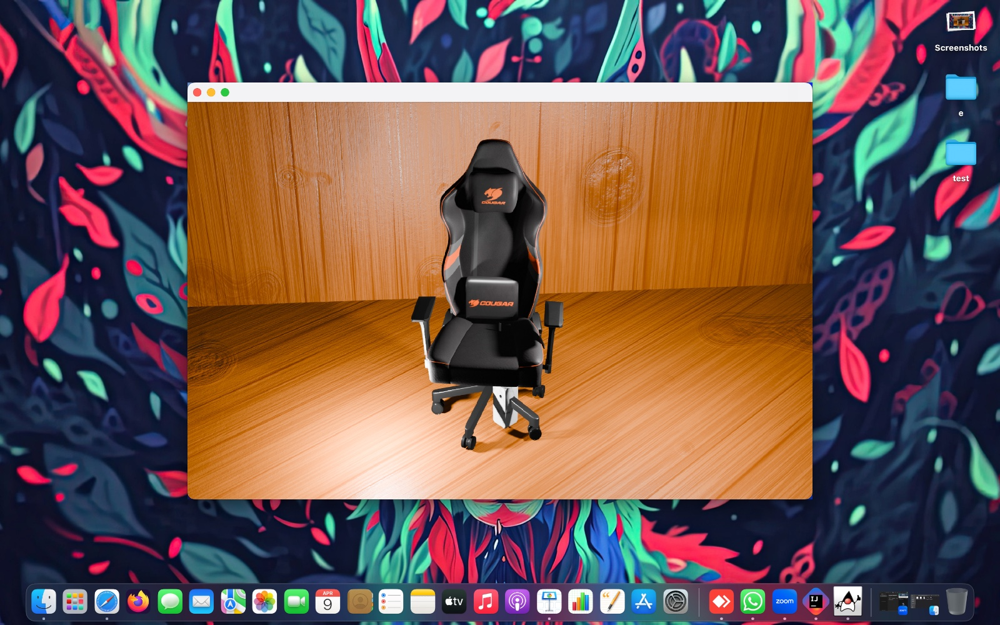
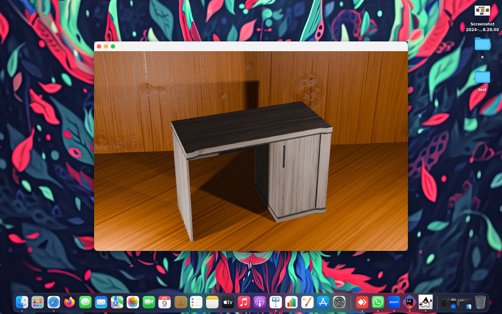

# Senura Ferniture
Senura Furniture is a Java Swing application designed for showcasing both 2D and 3D furniture products in a virtual shop environment. It provides users with an interactive experience to explore various furniture items, visualize them in 2D and 3D, and make informed purchase decisions.

## Features

- **Virtual Showroom**: Users can browse through a virtual showroom containing a wide range of furniture items, including sofas, chairs, tables, cabinets, and more.
  
- **2D Visualization**: Each furniture item is presented with detailed 2D illustrations, allowing users to view dimensions, colors, materials, and other specifications.

- **3D Modeling**: Users can interact with 3D models of furniture items, enabling them to rotate, zoom, and inspect products from different angles to get a better understanding of their design and aesthetics.

- **Product Information**: Detailed product information is provided for each item, including descriptions, features, pricing, and availability.

- **Search and Filter**: Users can easily search for specific furniture items or filter products based on categories, styles, prices, and other criteria to find items that match their preferences.

- **Shopping Cart**: A built-in shopping cart allows users to add selected items for purchase, review their selections, and proceed to checkout.

- **User Accounts**: Registered users can create accounts, save favorite items, track order history, and manage personal preferences.

- **Admin Panel**: An administrative panel allows authorized personnel to manage product listings, update inventory, monitor sales, and perform other administrative tasks.

## Screenshots

### Application Preview

| Login Screen | Dashboard | Product Catalog |
| :---: | :---: | :---: |
|  |  |  |

### Features inside the App

| Product Detail | Customization | 3D Visualization |
| :---: | :---: | :---: |
|  |  |  |

### 3D Modeling Gallery

| Bed (3D) | Gaming Chair (3D) | Wood Desk (3D) |
| :---: | :---: | :---: |
|  |  |  |

## Getting Started

### Prerequisites

- Java Development Kit (JDK)
- IDE (Integrated Development Environment) such as IntelliJ IDEA or Eclipse

### Installation

1. Clone the repository:
    https://github.com/Ravindu-Priyankara/hci-cousework.git

2. Open the project in your preferred IDE.

3. Build and run the application.

## Contributing

Contributions are welcome! If you'd like to contribute to Senura Furniture, please follow these steps:

1. Fork the repository.
2. Create a new branch (`git checkout -b feature/your-feature-name`).
3. Make your changes.
4. Commit your changes (`git commit -am 'Add new feature'`).
5. Push to the branch (`git push origin feature/your-feature-name`).
6. Create a new pull request.

## License

This project is licensed under the MIT License - see the [LICENSE](LICENSE) file for details.

## Acknowledgments

Special thanks to the developers and contributors of Java Swing, as well as any third-party libraries or resources used in this project. [Blender](https://www.blender.org/) was used for 3D modeling and rendering, and a third-party video player was used for multimedia content playback.
